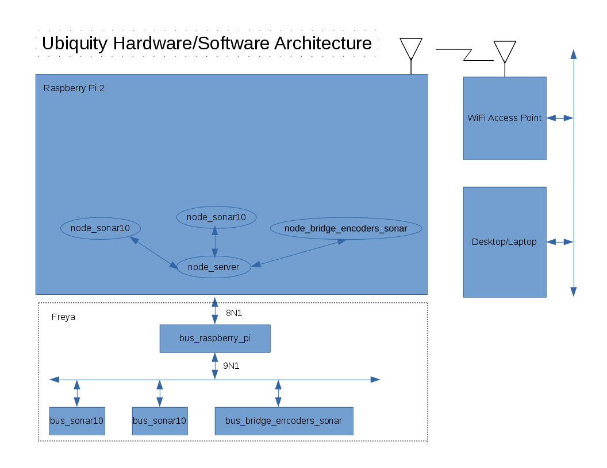

# ubiquity-misc

This repository constains files used by the Ubiquity team
that have no other obvious place to be put.  For now,
this repository contains all othe documentation and shell
files used to the Ubiqutiy/Ubuntu/ROS Kernel image.

If you read this documentation and it does not work for
you, please do the following:

1. Make a clone of this repository on you local desktop/laptop.

        cd /tmp           # Or someplace else of your choosing
        git clone https://github.com/UbiquityRobotics/ubiquity-misc.git
        cd ubiqutiy-misc

2. Edit this file (`README.md`) using your favorite editor.
   Insert you comments and/or questions directly into the file
   using the following format:

        > * ....
        > ....
        > .... -- {your_name} *

   By way of explanation, lines start with `>` are indented
   by the markdown processor.  The `*` causes the text to be
   italicized.

3. Stuff the question(s) back up to the repository:

        git add README.md
        git commit -m "Added some questions/comments."
        git push

## Ubiquity/Ubuntu/ROS Kernel Image

The Ubuquity/Ubuntu/ROS Kernel Image is a Ubuntu 14.04LTS
Kernel for the ARM7 hard float architecture.  This image
has many Ubuntu and ROS packages preinstalled along with
a ROS catkin workspace.  The primary purpose of this image
is to ensure that all of the Ubiquity robot platforms start
from a common software base.

This kernel image only works for Ubuntu 14.04LTS
(i.e. "Trusty").

### Download and Installing the Ubiquity/Ubuntu/ROS Kernal Image

The most common way of install the image is to download
the image and copy it onto a micro-SD card.  THe micro-SD
card is plugged into a Raspberry Pi 2 and the Raspberry Pi 2
is powered up.  Please do the following steps:

1. Get a micro-SD card that is at least 4GB is size.  Frankly,
   we recommend a minimum of 16GB.

2. Get either a USB/micro-SD adapter or regular SD to micro-SD
   card adaptor and plug your micro-SD card into it.

3. On your laptop/desktop, run the following command on your
   Ubuntu 14.04LTS kernel from the command line:

        sudo blkid

   This will print a bunch of stuff out.

4. Insert your micro-SD adapter into your desktop and run
   the same command again:

        sudo blkid

   Again, this will print a bunch of stuff out.

5. For the `bmaptool copy` command further below, we are going
   to need to type in the correct location to copy the
   Ubiquity/Unbuntu/ROS kernel to.  This will have a form
   of `/dev/XXXX`, where `XXXX` depends upon your system.

   Now look through the two lists and visually search for the
   new entries from the first and second invocations of `blkid`.

   If see a one or two new lines show up that look like:

        /dev/sdX#: UUID="..." TYPE="..."

   The `X` will be a lower case letter (typically `a` or `b`)
   and the `#` will be a digit like `0` or `1`.
   The `/dev/XXXX` for the `bmaptool copy ...` command will be
   `/dev/sdX` where `X` is the lower case letter.

   Alternatively, if you see one or two lines that look like:

        /dev/mmcblk@p# UUID="..." TYPE="..."

   where both `@` and `#` are digits like `0` or `1`.
   The `/dev/XXX` for the `bmaptool copy ...` will be `/dev/mmcblk@`
   (i.e. no `p#`.)

   Write down the /dev/XXXX value we have just determined, we are
   going to need it later.

6. Download the image using the following commands:

        cd /tmp	       # Or someplace else if you choose...
        wget http://gramlich.net/2015-04-30-ubuntu-trusty.zip

7. Unpack the .zip file using the following command:

        unzip *.zip

   This should result in a *.img and *.bmap file.

8. Copy the .img file onto the micro-SD card.  This is the
   place where you will type in the value for `/dev/XXXX`
   that was determined in step 5 above.  Run the following
   commands:

        sudo apt-get install -y bmap-tools
        sudo bmaptool copy --bmap *.bmap *.img /dev/XXXX
	sudo rsynch

   Remember to replace `/dev/XXXX`.

9. Remove the micro-SD card from the adaptor and plug it into
   Raspberry Pi 2 micor-SD slot.  This slot is on the *back*
   of the Raspberry Pi 2.

10. A RJ45 Ethernet cable between your Raspberry Pi 2 and
    your router.

11. Apply power to the Raspberry Pi 2 via the micro-USB
    connector on the edge of the the Raspberry Pi 2.

12. Wait about a minute.  The LED's on the Raspberry Pi 2
    should stop blinking.

13. Connect to the Raspberry Pi 2 from your laptop desktop:

        ssh ubuntu@ubuntu.local
        # If you asked a yes/no questions, answer `yes`.
        # Password is `ubuntu`

    You should see a prompt that looks like:

        ubuntu@ubuntu:~$

    You are in.  Now you need to do some additional steps.

14. Expand the 2nd partion to the full size of the micro-SD card:

        sudo fdisk /dev/mmcblk0
        # Delete 2nd partition with (d,2)
        # Recreate 2nd partition with (n,p,2,enter,enter)
        # Write the new 2nd partition out (w)
        #
        # Now immediately reboot:
        sudo reboot

15. Login again and resize the file system:

        # From you deskop/lapto:
	ssh ubuntu@ubuntu.local
        sudo resize2fs /dev/mmcblk0p2

16. Install a swap file:

        sudo apt-get install dphys-swapfile

17. Make sure that you have the linux-firmware (should be already done).

        sudo apt-get install linux_firmware

18. Make sure the file `/etc/modules-load.d/raspi-camera.conf`:

        sudo sh -c 'echo "bcm2835-v4l2 gst_v4l2src_is_broken=1" > /etc/modules-load.d/raspi-camera.conf'

19. Create a catkin workspace:

        cd ~
        mkdir -p catkin_ws/src
        cd catkin_ws
        catkin_make

20. Add `~/devel/setup.bash` to the end of `~/.bashrc`:

        echo "source ~/catkin_ws/devel/setup.bash" >> ~/.bashrc
        source ~/.bashrc

### Constructing the Kernel Image from Scratch

This Ubiquity/ROS/Ubuntu Kernel image is constructed with
two scripts:

* `rpi2-build-image.sh` which does most of the building,  and

* `cleanup.sh` does the wrap-up work.

It should be possible to run these scripts on a either
Ubuntu 14.04LTS kernel running 64-bit x86 architecture
or on a Raspberry Pi 2 (hereafter shorted to RasPi2.)

This shell script is run as follows:

	sudo rm -rf /srv
	cd {directory that contains rpi2-build-image.sh}
        sudo ./rpi2-build-image.sh

As of now, this script fails when it trys to unmount
`/srv/rpi2/trusty/build/chroot/proc`.  The work around
is to reboot the machine:

        sudo reboot

Now finish everything off by running the remainder of the
script that is now sitting in `.../cleanup.sh`.

        sudo cleanup.sh

The result show up in `/srv/rpi2/trusty/` as two files
with suffixes that end in `.img` and `.bmap`.  There
are two things that can be done:

* The files can be compressed into a `.zip` file and put
  on a internet so that other people can download and
  install the image onto a micro-SD card.  Here is the
  command that does it:

        zip rpi2_kernel.zip *.img *.bmap

  The resulting `rpi2_kernel.zip` file can be put up on
  a server.  Please feel free to change `rpi_kernel` to
  something with a bit more information.

* The files can be copied directly onto a micro-SD card
  using the bmap-tools listed above:

        sudo apt-get install -y bmap-tools
        sudo bmaptool copy --bmap *.bmap *.img /dev/XXXX

  where XXXX is the appropriate raw device name for the
  micro-SD card.

## `gscam` Notes

The following commands build gscam:

        sudo modprobe bcm2835-v4l2 gst_v4l2src_is_broken=1
        sudo apt-get build-essential g++
        cd ~
        mkdir -p catkin_ws/src
        cd catkin_ws
        catkin_make
        source devel/setup.bash
        cd src
        git clone https://github.com/ros-drivers/gscam.git
        rosdep update
        sudo apt-get install ros-indigo-image-common
        catkin_make
        roslaunch fiduicals_lib gscam.launch
        rosrun image_view image_view image:=/camera/image_raw

## WiFi Networking Issues

The problem is linux saves hard lan and wifi dongle macs and keeps
adding devices so you end up with say `eth2` but your
`/etc/network/interfaces` only has entry for `eth0`.

Here are some notes for sorting this out.  Tthe last half of this
set of cheet-sheet notes.

[Linux Network Specific]( https://help.ubuntu.com/lts/serverguide/network-configuration.html)

* `ifconfig   [eth0]`:
  Shows network interface(s) that have been configured or
  maybe partly configured (like WiFi that cannot find network)

* `sudo ifconfig eth0 10.0.0.100 netmask 255.255.255.0` :
  You can temp configure one till reboot.

* `/etc/hostname`:
  This is where system hostname is defined on reboot.
  Also edit `/etc/hosts` if you do change host name!

* `/etc/network/interfaces`:
  Entries tie hardware like `eth0` and `wlan0` to be of a specific
  network port type. KEY file, see other places in doc.

* `/etc/resolv.conf`:
  Holds DNS resolutions (ip addresses).  Best to use tool to do this
  `dmesg | grep eth` Can show if eth0 or wlan0 was re-named due to
  new flash image.  Come up with no net and edit `/etc/network/interfaces`

* `/etc/udev/rules.d/70-persistent-net.rules`:
  Edit this if you have left over `eth0` or `wlan0` from prior image
  so you get nice clean `eth0` and `wlan0`.
  This file has mac address to names like `wlan0`, `wlan1` and `eth0`
  and so on. Clean it out to have fresh discovery.

* `sudo ifup eth0`:
  Manually enable newly added interface from recent
  `/etc/network/interfaces`.  Can also use `sudo ifdown eth0`.

Sorting out linux images on ubuntu when networks get added:

* Boot up with hdmi monitor and usb keyboard usually (if no
  network no ssh ability)

* `sudo vi /etc/hosts` and `/etc/hostname` and set correct hostname
  for your system.

* `ifconfig` from here we want to see the eth0 and when wifi
  dongle is in `wlan0`.

* To hard-reset things, `sudo vi /etc/udev/rules.d/70-persistent-net.rules`

  1. Remove all the lines below top 2 lines of general comments as it
     is here that you may find your ethernet was nammed `eth2` or
     something and `/etc/network/interfaces` does not match so you
     get no network

  2. `sudo vi /etc/network/interfaces` and have just the use of `eth0`
     and `wlan0`, NOT higher numbers.

* Reboot and again on hdmi monitor.  Do `ifconfig` and hopefully
  you have `eth0` now and if you had wifi and config in
  `/etc/network/interfaces` for `wlan0` you also have wifi now

## Ubiquity Hardware/Software Architecture

The top level Ubiquity Hardareware/Software architecture
diagram is shown below:

<BlockQuote>

</BlockQuote>

Each light blue rectangle corresponds to a hardware
assembly.  I the diagram above, the following hardware
assemblies exist:

* Raspberry Pi 2: This is were ROS is run.  The ROSCore node
  runs here.

* bus_raspberry_pi: This is a module the interfaces the
  Raspberry Pi 2 to the bus.

* bus_sonar_10: This module can control up to 10 HC-SR04
  sonar modules.  There are two of these modules on a Freya.

* bus_bridge_encoders_sonar: This module has the electronics
  to drive two motors and encoders.  (It also can drive two
  HC-SR04 sonar modules, but that is not actually used.)

* WiFi Access Point:  This module provides a wireless access
  point so that the robot can communicate with the desktop/laptop.

* Desktop/Laptop: This is the machine on which software is
  developed and debugged.  While ROS runs on this machine as well,
  it accesses the ROSCore node on the Raspberry Pi 2.

The ovals correspond to ROS nodes.  There is a one-to-one
relationship between the bus hardware boards and ros nodes.
The `node_server` node is associated with the `bus_raspberry_pi`
node.

The bus_server_node is a traffic cop that multiplexs messges
from other ROS nodes to the bus through the bus_raspberry_pi
hardware module and back.

There are two commuication protocols:

* 8N1: The 8N1 protocol is 1 start bit, 8 data bits,
  no parity and 1 stop bit.  The Raspberry Pi 2 UART
  supports this protocol with an on chip UART.

* 9N1: The 9N1 protocol is 1 start bit, 9 data bits,
  no parity and 1 stop pit.  The all of the modules connected
  to the hardwar bus talk 9N1 protocol.

The Raspberry Pi2 on chip UART does not support 9N1 mode;
hence, the requirement for the bus_raspberry_pi module to
convert between the two protocols.

The bus architecture has gone through many many iterations:

* [Robobricks](http://gramlich.net/projects/robobricks/index.html):
  This version was built around PIC12 modules.  It actually
  actually sold by Robot Store for a while back in the early
  2000's back before Robot Store was acquire by Jameco.

* [Robobricks2](http://gramlich.net/projects/rb2/index.html):
  This verison is built around PIC16 modules.

* [Robus/Makerbus](http://gramlich.net/projects/robus/index.html):
  This version is built around NXP ARM Cortex 3 modules
  (LPC17xx series.)  These boards are all surface mount.
  There were two names that we played around with -- Makerbus
  and Robus.  They both describe the same bus.

The ubiquity modules are all simply called "bus" and are
based around Atmel ATmega microcontrollers to be compatible
with the Arduino&tm; community.  These modules
are both electrically and software compatible with the
Robus/Makerbus modules.

Please read the
  [MakerBus Specifications](http://gramlich.net/projects/robus/specifications.html)
to get all of the electrical, software, and mechancal details.

Associated with this project is a software tool to help
configure the modules called
  [configurator](http://gramlich.net/projects/configurator/index.html).
Please note, that this is not the same thing that Rohan talks
about when he says "configurator".  The MakerBus/Robus configurator
is going to be depricated and switched over to use ROS configuration
technology.

The ultimate architecture is that each hardware module presents
its functionality that is organized as a bunch of registers.
Some registers are written to at start up time to perform
configuration.  After configuration, registers are written
to trigger actuators and read to read sensors.

All of the register information for a hardware module is described
in a single .xml file.  It lists each register, it type (Boolean,
Byte, Short, Integer, Long, etc.), a textual desciption, the register
index, etc.  A stand-alone batch processor reads the .xml file and
generates a whole bunch of files needed by ROS to talk to the hardware
module.  The initial code is currently living in the
  [bus_slave](https://github.com/UbiquityRobotics/bus_slave)
repository in the `bus_code_generatory.py` file.  This code is
going to be expanded and likely moved to its own repository.

The requirements of the bus software architecture are:

* Easy edition of new modules.

* Integration with ROS parameters and dynamic configuration.

* Bus discovery whereby the bus is scanned to determine which
  modules are on it.

* Bus firmware update whereby the firemware can be updated from ROS.

* Code generation where boiler plate code is generated to make
  it easier to maintain code.

* Documentation generation where documentation files are automatically
  generated.

* Testing support is generated so it is easy to test modules.

## Software Tasks

### General

* identify robot operating modes (development, deployment,
  trade-show, setup, etc.)

### Networking

We have a bunch of major issues to wrestle to the ground:

* Each robot needs a unique hostname so that zeroconf can
  give each robot a unique IP address.

* Use some sort of `avahi-browse` functionality to find all robots.

* Allow user to switch easily between robots.

* Each robot needs to be able to log into a bunch of different
  WiFi access points.

* Key management.  SSH.  WiFi.

* Time synchroniziation.  (What about mutliple robots?)

* Wrestle the WiFi dongle issues to the ground.

* Make sure we work with multiple SSID's and single replicated SSID's.

* Need dongle that supports WiFi client and access point on RasPi2

* How do we do multi-robot applications?

### Robot Software Development

* Software development needs to occur on desktop/laptop machines.
  We need to make access to the robot easy.

* Perhaps use NFS to mount a common `src` directory between
  the laptop/desktop file system and the robot file system.
  Allow catkin_make to build on both the robot (ARM7) and the
  desktop/laptop (amd64) using same `src` directory.

* Create an `rx` command that reads the ROS_MASTER_URI, extracts
  the robot host name, and does `ssh user@ROBOT_HOSTNAME.local command`.

* We need to start using branches for development (e.g. indigo-wayne,
  indigo-mark, indigo-joe, indigo-kurt, indigo-rohan, etc.)

* Debugging C++ Node.  Need to run a node under the debugger and use
  a remote debugger UI.  Possibilities: gdb -tui, DDD, Kdevelop, etc.?

* Debugging Python Node. Node to run a node with a debugger.

* Document explaining developement is needed.

* Need some multi repository tool -- multi_git_status, multi_commit

* Support combine Arduino IDE and Arduino.Makefile development.

* We need a coherent place to store configuration files, launch
  files, etc.  We need a coherent .launch file strategy.

### Setup

* How does the user set things up?

### ROS Stack

* Find and fix bug with ARM7 `robot-state-publisher`

* Get `range-sensor-layer` to work.

* Bring fiducials, sonars, and encoders with navigation stack.

* Merge in game controllers.

* Get "Go To" application working.

* Bring up arm.

### Platforms

* Loki

  * Switch over to micro metal gearmotors and hall effect sensors.

  * Bring up real time clock.

  * Tune PID loops

* Freya

  * Refactor Loki Sonar code into Sonar10 modules.

  * Get ROS Arduino Bridge working with Sonar 10 modules

  * Tune PID loops

### Bus Software

* Write `.xml` regsiter definition files for `bus_sonar10`,
  `bus_bridge_encoders_sonar`, and `bus_loki`.

* Modify `bus_slave/bus_code_generator.py` to generate C++
  code fragments that can be specialized.

* Replace ROS Arduino Bridge.

  * Get bus_server_server.py to talk to other modules.

  * Get parameters to work.

  * Create odometry topic publisher.

  * Create sonar range topic publisher.

  * Create cmd_vel topic subscriber.

* Get dynamic reconfiguration working.

* Rewrite bus_server_server.py in C++.

* Rewrite topic publisher and subscribers in C++.

* Get bus reset to work.

* Get discovery to work.

* Get over the wire firmware upgrade to work.

### Bus Hardware

* Bring up additional modules -- bus_battery, bus_dynabus, bus_grove12,
  bus_servo32, bus_servo8, bus_shield, etc.

### Build

* Grind out weekly kernel images

* Make all repositories have package manifests.

## Scripts

### `mgit`

The `mgit` script a shell script that executes the same git command
across all all `src` sub-directories in a `catkin_ws` directory.
It can be executed executed in the `catkin_ws` directory or any
of the sub-directories under `catkin_ws`.

Examples:

List the status of each git repository the catkin workspace:

        mgit status

Pull the latest updates from all of the remote repositories:

        mgit pull

Perform a commit for all repositories that have had files
where a `git add` has been performed:

        mgit commit -m "..."

## Random Notes

	cd ~/catkin_ws/src
	# Install fiducials:
        git clone https://github.com/UbiquityRobotics/fiducials.git
        sudo apt-get install ros-indigo-tf ros-indigo-tf2-geometry-msgs

	# Install gscam
        git clone https://github.com/ros-drivers/gscam
        sudo apt-get install -y ros-indigo-image-common
        sudo apt-get install -y gstreamer0.10-plugins-good
        sudo apt-get install -y libgstreamer0.10-dev
        sudo apt-get install -y libgstreamer-plugins-base0.10-dev

	# Install joystick drivers and ROS Arduino Bridge:
        git clone https://github.com/UbiquityRobotics/joystick_drivers.git
        git clone https://github.com/UbiquityRobotics/ros_arduino_bridge

